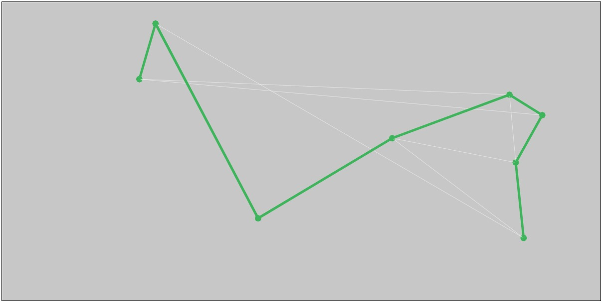

# The Traveling Salesperson Problem

Finding the optimal path between points (cities, stores, warehouses, ...)
  
This kind of problem requires a huge computational power. For example, calculating the best path between 14 points (a reasonable number), gives you 87.178.291.200 possibilities to check. 

## Inspiration
https://en.wikipedia.org/wiki/Travelling_salesman_problem
 
https://www.youtube.com/user/shiffman

## How does it look like?

## Dependencies
> p5.js
